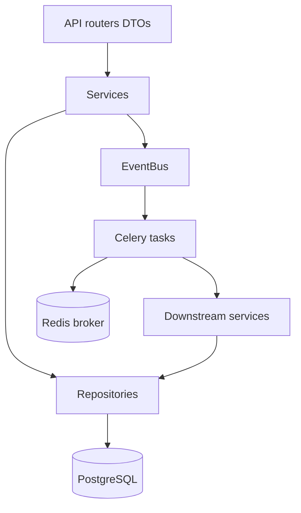

# Phase 1 — Clean Architecture, Redis, Celery, Event Bus

**Status:** Complete  
**Scope:** Infrastructure refactor only. No black-hat features. No Google scraping. No indexing guarantees.  
**Rule:** Every existing MVP HTTP contract must keep working.

---

## Honest limitations (unchanged)

- Google decides whether a page is indexed; this platform only maximises legitimate discovery signals.
- IndexNow is own-domain only (`pintdown.site`).
- Manual `site:` Check Now remains the only honest third-party indexing verification.
- `authority_score` stays manual; never auto-fetched from paid SEO APIs.

---

## Goals

1. Move from flat packages to modular Clean Architecture under `app/modules/*`.
2. Introduce Repository + Service + DTO boundaries.
3. Introduce lightweight Dependency Injection via FastAPI `Depends` factories.
4. Replace FastAPI `BackgroundTasks` with **Redis + Celery** for all discovery async work.
5. Introduce an in-process **Event Bus** that fans out domain events to Celery tasks.
6. Keep API paths and payloads backwards-compatible with the MVP frontend.
7. Pass all existing tests (Celery runs in eager mode under pytest).

## Non-goals (later phases)

- Discovery validator / health score (Phase 2)
- Multi-hub / multi-sitemap expansions beyond current behaviour (Phase 3 polish)
- Enterprise analytics / PDF-Excel (Phase 4)
- RBAC / API tokens / webhooks (Phase 5)
- AI scoring / predictive fields (Phase 6)

---

## Target layout

```
backend/app/
  main.py                          # composition root
  modules/
    shared/
      config.py
      db.py
      di.py              # Depends factories
      events.py          # Domain events + EventBus
      celery_app.py
    authentication/
      dto.py
      service.py
      api.py
      tests/
    backlinks/
      models.py
      repository.py
      dto.py
      service.py
      api.py
      tasks.py           # Celery: discovery pipeline orchestrator
      tests/
    feeds/
      generator.py
      service.py
      api.py
      tasks.py
      tests/
    websub/
      models.py
      repository.py
      service.py
      tasks.py
      tests/
    indexnow/
      service.py
      api.py
      tasks.py
      tests/
    analytics/
      service.py
      api.py
      tests/
    notifications/
      service.py
      tasks.py
      tests/
    logs/
      models.py
      repository.py
      service.py
    api/
      router.py          # aggregates module routers
```

Compatibility shims remain at the old import paths (`app.backlinks`, `app.shared`, …) so Alembic and any external imports do not break abruptly.

---

## Layering



| Layer | Responsibility |
|--------|----------------|
| **API** | HTTP, auth dependency, map DTO ↔ response. No business rules. |
| **DTO** | Pydantic request/response models. |
| **Service** | Use-cases (create backlink, sync, submit IndexNow). Publishes events. |
| **Repository** | Persistence only (SQLAlchemy queries). |
| **Tasks** | Celery workers calling services. Idempotent where practical. |
| **Events** | Immutable domain facts (`BacklinkCreated`, `DiscoverySyncRequested`, …). |

---

## Event bus

Domain events (Phase 1):

| Event | Emitted when | Handlers |
|--------|--------------|----------|
| `BacklinkCreated` | POST backlink / bulk / CSV | `discovery.run_pipeline` |
| `BacklinkUpdated` | PUT backlink | `discovery.run_pipeline` |
| `DiscoverySyncRequested` | POST `/api/sync` | `discovery.run_pipeline` |
| `FeedsRegenerated` | After feed write | optional notify (Telegram) |
| `PipelineFailed` | Step error | `notifications.notify` |

`EventBus.publish(event)` enqueues Celery handlers. It never runs heavy I/O inline in the request thread (except when `CELERY_TASK_ALWAYS_EAGER=true` in tests).

---

## Celery topology

| Queue | Tasks |
|--------|--------|
| `discovery` | `run_discovery_pipeline` |
| `feeds` | `regenerate_feeds` (callable from pipeline) |
| `default` | notifications, misc |

Pipeline steps (same as MVP, now in a worker):

1. Regenerate feeds  
2. WebSub ping (retry/backoff inside service)  
3. IndexNow own-domain URLs only  
4. Pipeline log + Telegram summary  

Env:

- `REDIS_URL=redis://redis:6379/0`
- `CELERY_BROKER_URL` (defaults to Redis)
- `CELERY_RESULT_BACKEND` (defaults to Redis)
- `CELERY_TASK_ALWAYS_EAGER` for tests / local without worker

---

## Dependency injection

Factories in `modules/shared/di.py`:

- `get_settings`
- `get_db`
- `get_event_bus`
- `get_backlink_service`
- `get_feed_service`
- `get_websub_service`
- `get_indexnow_service`
- `get_analytics_service`
- `get_notification_service`
- `get_pipeline_log_service`

Routers depend on services, not repositories.

---

## Backwards compatibility

| Contract | Status |
|----------|--------|
| `/api/auth/*`, `/api/backlinks*`, `/api/sync`, `/api/analytics` | Unchanged paths |
| `/api/public/featured` | Unchanged |
| `/feed.xml`, `/feed.atom`, `/feed.json` | Unchanged |
| `/{indexnow_key}.txt` | Unchanged |
| Response JSON shapes | Unchanged |
| Soft-delete semantics | Unchanged |

---

## Docker / Coolify

New services:

- `redis`
- `worker` (`celery -A app.modules.shared.celery_app.celery worker -Q discovery,feeds,default -l info`)

API container no longer runs discovery inline (unless eager mode).

---

## Testing strategy (Phase 1)

- `CELERY_TASK_ALWAYS_EAGER=true` + `CELERY_TASK_EAGER_PROPAGATES=true` in pytest.
- Existing feed / WebSub / IndexNow / pipeline tests must still pass.
- Add unit tests for: EventBus dispatch, repository soft-delete filter, Celery task wiring (eager).

---

## Migration path for this phase

1. Add modules + shims (dual import paths).
2. Switch pipeline enqueue from `BackgroundTasks` → `EventBus` → Celery.
3. Point `main.py` at `modules.api.router`.
4. Update docker-compose + `.env.example`.
5. Run full pytest; publish `docs/migration/PHASE_1_NOTES.md`.
6. Later phases may delete shim packages once nothing imports them.

---

## Exit criteria

- [x] Architecture doc committed (this file)
- [x] Modules exist with Service / Repository / DTO / API / Tasks where applicable
- [x] Redis + Celery in docker-compose; worker service defined
- [x] Discovery no longer depends on FastAPI `BackgroundTasks`
- [x] All prior tests green; new DI/event/celery tests green
- [x] Migration notes published
- [x] README / `.env.example` updated for Redis/Celery env vars
