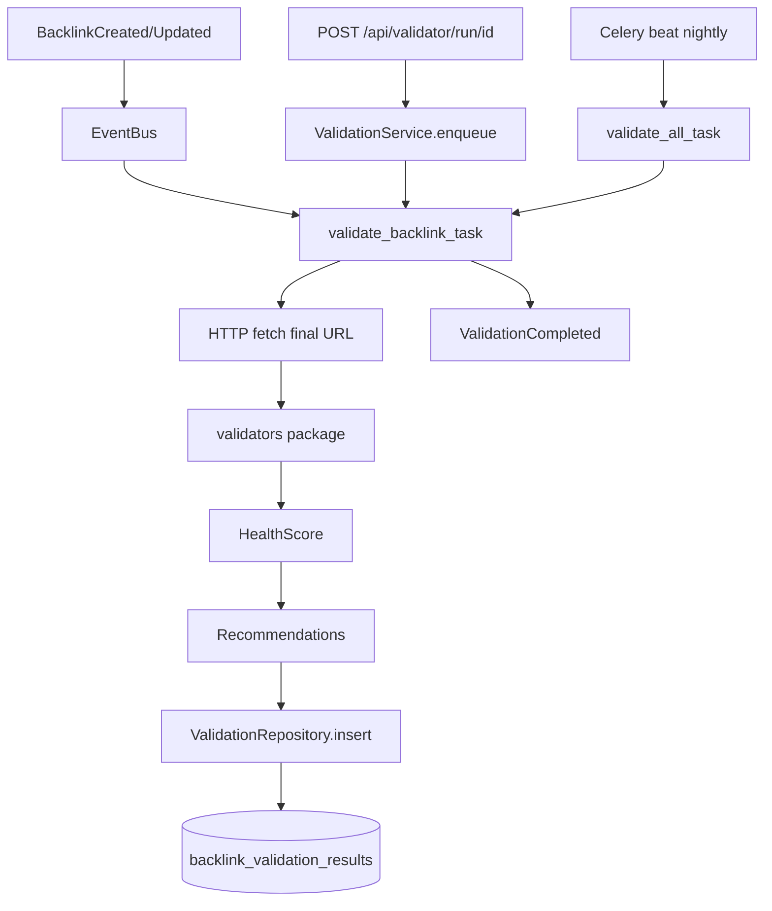

# Phase 2 — Discovery Validator & Crawlability Intelligence

**Status:** Complete  
**Depends on:** Phase 1 (modules, EventBus, Celery, Redis)  
**Rule:** No breaking changes to existing HTTP contracts. No Google scraping. No indexing guarantees.

---

## Honest limitations

- This module analyses **technical signals on the backlink URL only** (HTTP, robots, HTML, headers).
- It does **not** determine whether Google has indexed the page.
- Health Score is **advisory** — it does not predict indexing and must never be marketed as such.
- Manual Google `site:` Check Now (Phase 1) remains the only honest human verification of third-party indexing.
- Never scrape Google Search, never automate Google, never use browser automation against Google.

---

## Goals

1. Add `discovery_validator` module following Clean Architecture.
2. Persist **append-only** validation history (`backlink_validation_results`).
3. Run validation asynchronously via Celery (never block API).
4. Auto-trigger on backlink create/update; support manual recheck + nightly batch.
5. Expose read/run APIs without changing existing endpoints.
6. Ship an internal dashboard page for latest validation + history.
7. Keep all Phase 1 tests green; add module-focused tests.

## Non-goals

- AI recommendations / hallucinated insights (Phase 6)
- Multi-sitemap engine (Phase 3)
- RBAC (Phase 5)
- Claiming indexability outcomes

---

## Module layout

```
backend/app/modules/discovery_validator/
  __init__.py
  api/
    __init__.py
    routes.py
  services/
    __init__.py
    validation_service.py      # orchestrates fetch + scoring + persist
    health_score.py            # weighted 0–100
    recommendations.py         # deterministic rules
  repositories/
    __init__.py
    validation_repository.py
  dto/
    __init__.py
    schemas.py
  models/
    __init__.py
    validation.py              # BacklinkValidationResult ORM
  events/
    __init__.py
    domain.py                  # ValidationStarted/Completed/Failed/Retried
  tasks/
    __init__.py
    validation_tasks.py        # Celery
  validators/
    __init__.py
    url_http.py                # format, HTTPS, redirects, status, timing
    robots.py                  # robots.txt allow/block/unknown
    html_meta.py               # title, desc, h1, word count, meta robots, canonical, hreflang, lang
    headers.py                 # x-robots-tag, content-type, content-length
    structured_data.py         # JSON-LD / microdata / RDFa type names only
    social.py                  # OG + Twitter Card presence + key fields
    link_rel.py                # dofollow/nofollow/ugc/sponsored heuristics on page links to pintdown.site
  tests/                       # also mirrored under backend/tests/
```

Phase 1 flat-file modules remain untouched; this module uses subpackages as specified.

---

## Data flow



1. Enqueue only from API / EventBus / beat — no inline validation in request thread.
2. Worker fetches the **backlink URL** (the third-party page), follows redirects (capped).
3. Parallelisable steps: robots.txt for final host; HTML parse; header analysis.
4. Persist one new row (history never overwritten).
5. Publish `ValidationCompleted` (or `ValidationFailed`).

---

## Background job flow

| Trigger | Event / entry | Celery task |
|---------|---------------|-------------|
| Backlink created | `BacklinkCreated` (extend EventBus) | `discovery_validator.validate_one` |
| Backlink updated | `BacklinkUpdated` | same |
| Manual | `POST /api/validator/run/{id}` | same |
| Run all | `POST /api/validator/run-all` | `discovery_validator.validate_all` → fans out |
| Nightly | Celery Beat cron | `discovery_validator.validate_all` |

**Queue:** `discovery` (reuse Phase 1 queue)  
**Retries:** max 3, exponential backoff `60s * 2^n`, publish `ValidationRetried` before retry.  
**Idempotency:** each run inserts a new history row; concurrent runs for same id are allowed (last completed is “latest”).

Task signature stores Celery `task_id` on the result row when available (`celery_task_id` column) for observability.

---

## Database changes

### New table `backlink_validation_results`

| Column | Type | Notes |
|--------|------|-------|
| id | String(36) PK | UUID |
| backlink_id | String(36) FK → tracked_backlinks.id | indexed |
| validated_at | DateTime(tz) | |
| celery_task_id | String(100) nullable | observability |
| final_url | Text nullable | |
| redirect_count | Integer | |
| redirect_chain | Text nullable | JSON list of URLs |
| http_status | Integer nullable | |
| response_time_ms | Integer nullable | |
| content_type | String(255) nullable | |
| content_length | Integer nullable | |
| robots_status | String(20) | allowed / blocked / unknown |
| robots_detail | Text nullable | |
| meta_robots | Text nullable | raw |
| x_robots_tag | Text nullable | raw |
| canonical_url | Text nullable | |
| canonical_type | String(40) | self / external / missing / multiple / loop / unknown |
| hreflang | Text nullable | JSON |
| language | String(50) nullable | |
| title | Text nullable | |
| meta_description | Text nullable | |
| h1 | Text nullable | |
| h2_count | Integer nullable | |
| word_count | Integer nullable | |
| schema_types | Text nullable | JSON list |
| og_present | Integer 0/1 | |
| og_data | Text nullable | JSON subset |
| twitter_card_present | Integer 0/1 | |
| twitter_data | Text nullable | JSON subset |
| rel_type | String(40) nullable | dofollow / nofollow / ugc / sponsored / unknown / mixed |
| health_score | Integer 0–100 | advisory |
| warnings | Text | JSON list |
| recommendations | Text | JSON list |
| error | Text nullable | if run failed partially |
| created_at | DateTime(tz) | |

Alembic revision: `002_backlink_validation_results`.

Soft-deleted backlinks: validation endpoints return 404; nightly skip soft-deleted.

---

## API additions (auth-protected)

Mounted under `/api` for cookie auth + Next rewrite compatibility. Documented paths:

| Method | Path | Behaviour |
|--------|------|-----------|
| POST | `/api/validator/run/{id}` | Enqueue one; return `{queued: true, task_id, backlink_id}` |
| POST | `/api/validator/run-all` | Enqueue batch; return `{queued: true, task_id}` |
| GET | `/api/validator/{id}` | Alias of **latest** for convenience |
| GET | `/api/validator/latest/{id}` | Latest result DTO |
| GET | `/api/validator/history/{id}` | Paginated history (newest first) |

Existing `/api/backlinks*`, feeds, IndexNow, analytics **unchanged**.

Every response includes:

```json
"disclaimer": "Health Score is advisory technical guidance only. It does not predict or guarantee search-engine indexing."
```

---

## Event flow

New domain events (`modules/discovery_validator/events/domain.py`), handled by EventBus extensions in `modules/shared/events.py`:

| Event | When | Handlers |
|-------|------|----------|
| `ValidationStarted` | Task begins | structured log |
| `ValidationCompleted` | Row persisted | optional Telegram summary (short) |
| `ValidationFailed` | Unrecoverable error | Telegram + log |
| `ValidationRetried` | Celery retry | log |

Phase 1 events `BacklinkCreated` / `BacklinkUpdated` gain an **additional** Celery dispatch to `validate_backlink_task` (pipeline task still runs). Order: pipeline and validation are independent parallel tasks.

---

## Health Score (configurable weights)

Defaults in Settings (env-overridable, sum normalised to 100):

| Factor | Default weight | Scoring sketch |
|--------|----------------|----------------|
| HTTP | 20 | 200→20; 3xx final 200→16; 404/410→0; 5xx→4 |
| Robots | 20 | allowed→20; unknown→10; blocked→0 |
| Canonical | 15 | self→15; missing→8; external→6; multiple/loop→3 |
| Meta robots | 15 | indexable→15; noindex→0; missing→10 |
| Content quality | 10 | title+h1+words≥150→10; thin→4; empty→0 |
| Structured data | 10 | ≥1 type→10; none→3 |
| Performance | 10 | &lt;1s→10; &lt;3s→6; else→2 |

**Disclaimer in UI and API:** advisory only; does not predict indexing.

---

## Recommendation engine (deterministic)

Rule table (examples): missing canonical; blocked by robots; noindex; 404/410; slow TTFB; missing H1; word_count &lt; 50; missing title; no structured data; no Open Graph; HTTPS upgrade suggested; redirect chain &gt; 3.  
No LLM calls. No fabricated “AI” text.

---

## Retry & error handling

| Case | Behaviour |
|------|-----------|
| DNS / connect / timeout | Retry up to 3; then `ValidationFailed` + row with `error` |
| HTTP 5xx | Score low; still persist analysis of headers if any |
| HTML parse failure | Persist HTTP/robots; warnings += parse_error |
| robots.txt fetch fail | `robots_status=unknown` |
| Soft-deleted / missing backlink | Task no-ops with log |

---

## Observability

- Structured logs: start, finish, duration_ms, retries, exceptions, celery_task_id, backlink_id.
- Persist `celery_task_id` on result rows.
- Pipeline-style optional notify on failure (Telegram if configured).

---

## Frontend

New internal page: `/internal/validator?id={backlinkId}` (and link from backlinks table “Validate / Health”).

Shows: health score, validated_at, HTTP, redirects, robots, meta robots, canonical, schema types, OG/Twitter, response time, word count, warnings, recommendations, history list, **Revalidate** button.

Banner: honest limitations (no indexing guarantee).

---

## Testing strategy

| Layer | Coverage |
|-------|----------|
| Unit | health_score weights; recommendations rules; robots allow/block parse; canonical classification; schema type extract |
| Repository | insert + latest + history order |
| Celery | eager task persists row; retry path mocked |
| API | run/latest/history auth + 404 |
| Regression | full existing Phase 1 suite must pass |

Target: high coverage on `discovery_validator` package (practical ≥90% of new module lines via focused tests). No Google network calls in tests — httpx mocked.

---

## Nightly schedule

Celery Beat entry (docker-compose worker or dedicated beat service):

- `0 3 * * *` → `validate_all_task`  
Documented in migration notes; optional `CELERY_BEAT_ENABLED=true`.

For Phase 2 MVP of scheduling: include beat service in compose **or** document Coolify cron hitting `POST /api/validator/run-all` with admin session/token. Prefer Celery Beat in compose for self-contained ops.

---

## Exit criteria

- [x] Architecture doc (this file)
- [x] Alembic `002_*` migration
- [x] Module implemented + DI wired
- [x] EventBus dispatches validation on create/update
- [x] APIs live under `/api/validator/*`
- [x] Dashboard page
- [x] Migration notes `docs/migration/PHASE_2_NOTES.md`
- [x] New tests green + Phase 1 suite green
- [x] No Google scraping; disclaimers present

---

## Implementation order

1. Models + Alembic migration  
2. Validators + health + recommendations  
3. Repository + ValidationService  
4. Celery tasks + EventBus hooks  
5. API + DI + router  
6. Frontend page  
7. Tests + migration notes + README touch
