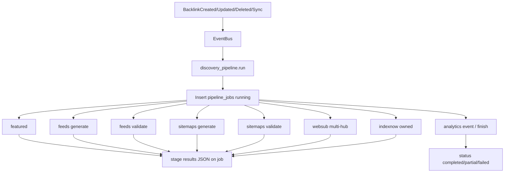

# Phase 3 — Enterprise Discovery Pipeline & Feed Distribution

**Status:** Complete  
**Depends on:** Phase 1 (modules, EventBus, Celery, feeds/WebSub/IndexNow), Phase 2 (validator — independent)  
**Rule:** No breaking HTTP contracts. No Google scraping. No indexing guarantees. IndexNow = own-domain only.

---

## Honest limitations

- Pipeline maximises **legitimate discovery assets** (feeds, sitemaps, WebSub, IndexNow for owned URLs).
- It does **not** force Google to index third-party backlink pages.
- IndexNow never receives third-party URLs.
- Health/status dashboards report job outcomes, not Google indexing outcomes.

---

## Goals

1. Introduce `discovery_pipeline` module: multi-stage, fault-isolated Celery orchestration.
2. Persist append-only **pipeline job history** + feed generation history.
3. Harden multi-feed generation + **feed validation** (warnings, not crashes).
4. Add **multi-sitemap** engine (`featured.xml`, `feeds.xml`, `resources.xml`, master index).
5. Harden multi-hub WebSub with **circuit breaker**, parallel hub pings, history.
6. Queue IndexNow asynchronously (owned URLs only).
7. Dashboard + APIs for jobs/stats/retry.
8. Wire `BacklinkChanged` (create/update/delete/sync) → pipeline without changing existing response shapes.

## Non-goals

- AI insights (Phase 6), RBAC (Phase 5), Excel/PDF reports (Phase 4).
- Rewriting Phase 1/2 modules — they become **stage adapters** called by the orchestrator.
- Guaranteeing search-engine indexing.

---

## Module layout

```
backend/app/modules/discovery_pipeline/
  api/routes.py
  services/
    orchestrator.py          # runs stages; isolates failures
    featured_stage.py
    feed_stage.py
    feed_validator.py
    sitemap_stage.py
    sitemap_validator.py
    websub_stage.py          # multi-hub + circuit breaker
    indexnow_stage.py
    metrics.py               # in-process counters (+ optional Prometheus text)
  repositories/
    job_repository.py
    feed_generation_repository.py
    hub_health_repository.py
  dto/schemas.py
  models/
    pipeline_job.py
    feed_generation.py
    hub_circuit.py
  events/domain.py
  tasks/pipeline_tasks.py
  validators/                # feed/sitemap XML helpers
  tests/
```

Phase 1 `feeds`, `websub`, `indexnow` remain the low-level implementations; Phase 3 orchestrates and records enterprise history.

---

## Event flow



### Domain events (Phase 3)

| Event | When |
|-------|------|
| `BacklinkChanged` | Unified trigger (maps from create/update/delete/sync) |
| `PipelineStarted` | Job row created |
| `FeedGenerated` / `FeedValidated` | Feed stages |
| `SitemapGenerated` / `SitemapValidated` | Sitemap stages |
| `WebSubCompleted` | After hub fan-out |
| `IndexNowCompleted` | After own-URL submit |
| `PipelineFinished` | All stages attempted |
| `PipelineFailed` | Catastrophic (could not start); per-stage failures → `partial` |

**Stage isolation:** each stage wrapped in try/except. One failure marks stage `failed` and continues. Job status:

- `completed` — all stages ok  
- `partial` — ≥1 stage failed, ≥1 succeeded  
- `failed` — all stages failed or pre-flight error  

---

## Queue architecture

| Queue | Tasks |
|-------|--------|
| `discovery` | `discovery_pipeline.run`, `discovery_pipeline.retry` |
| `feeds` | optional dedicated feed regen (called inline by orchestrator for simplicity in Phase 3) |
| `default` | notifications |

**Idempotency key:** `idempotency_key = sha1(event_type + backlink_id + bucket_ts)` where `bucket_ts` is floor(unix/30s). Duplicate enqueues within 30s reuse/skip if a job with same key is `running`/`completed`. Manual `POST /pipeline/run` and retries use unique keys.

Phase 1 task `discovery.run_pipeline` becomes a **thin shim** calling the Phase 3 orchestrator so existing Celery includes and patches keep working.

---

## Retry strategy

| Scope | Behaviour |
|-------|-----------|
| Celery task | `max_retries=2`, countdown `60 * 2^n` for worker crashes only |
| Per-stage WebSub hub | Exponential backoff inside stage (existing), circuit breaker skip |
| Manual | `POST /pipeline/retry/{job_id}` clones job with `parent_job_id`, increments `retry_count` |
| IndexNow | Single attempt per pipeline run; failures logged, not fatal |

---

## Feed generation lifecycle

1. Regenerate RSS/Atom/JSON via existing `FeedService` / generator (enhanced metadata: explicit `lastBuildDate` / `updated`).
2. Persist `feed_generation_history` row (paths, entry_count, duration_ms, ok).
3. Run feed validator → warnings JSON (invalid XML, missing channel title, duplicate guids, empty feed).
4. Emit `FeedGenerated` / `FeedValidated`.
5. Publish files under `data/feeds/` (unchanged public URLs `/feed.xml` etc.).

Pagination: default page size remains settings `feed_page_size` (default 100); validator checks count ≤ limit.

---

## Sitemap lifecycle

Write under `data/sitemaps/`:

| File | Contents |
|------|----------|
| `featured.xml` | `/featured` URL |
| `feeds.xml` | `/feed.xml`, `/feed.atom`, `/feed.json` |
| `resources.xml` | curated resource paths (featured + feeds + public hub) |
| `sitemap_index.xml` | index of the three |

Serve via FastAPI: `/sitemaps/{name}.xml`, `/sitemap_index.xml` (aliases). Frontend Next `sitemap.ts` remains; pipeline assets are additional discovery signals.

Validate well-formed XML + urlset/sitemapindex structure before marking stage ok.

---

## WebSub lifecycle

1. Load hub list from settings (`WEBSUB_HUB_URLS`).
2. Skip hubs in **open circuit** (`failures >= threshold` within window).
3. Ping remaining hubs (sequentially with short timeout — parallel via thread pool if >1).
4. Log each attempt (reuse `websub_log` + update `websub_hub_circuit`).
5. Success → reset failure count; failure → increment; open circuit after N failures.
6. Half-open: after `cooldown_seconds`, allow one probe.

One hub failure never aborts others or later stages.

---

## IndexNow lifecycle

Reuse `IndexNowService.submit_own_urls` with owned paths only (`/featured`, feeds, sitemap paths). Never third-party. Async = runs inside Celery stage only.

---

## Failure recovery

- Stage failures stored on job (`stages_json`).
- `partial` jobs listed on dashboard; **Retry** re-runs full orchestrator (idempotent writes).
- Soft-deleted backlinks still trigger pipeline (feeds must drop the URL).
- Catastrophic DB errors → job `failed`, Telegram if configured.

---

## Database changes (Alembic `003_pipeline`)

### `pipeline_jobs`

id, event_type, backlink_id nullable, trigger, status, idempotency_key, celery_task_id, worker_id, parent_job_id, retry_count, started_at, finished_at, duration_ms, queue_wait_ms, stages_json, failed_stages, error_message, created_at

### `feed_generation_history`

id, job_id nullable, feed_type (rss/atom/json), path, entry_count, ok, warnings_json, duration_ms, created_at

### `websub_hub_circuit`

hub_url PK, failure_count, success_count, state (closed/open/half_open), opened_at, last_failure_at, last_success_at, updated_at

Indexes: `pipeline_jobs(status)`, `pipeline_jobs(created_at)`, `pipeline_jobs(idempotency_key)` unique-ish (unique when not null).

---

## API additions (`/api/pipeline/*`, auth)

| Method | Path | Purpose |
|--------|------|---------|
| POST | `/api/pipeline/run` | Enqueue full pipeline (`BacklinkChanged` / manual) |
| POST | `/api/pipeline/retry/{job_id}` | Retry failed/partial job |
| GET | `/api/pipeline/jobs` | Filter status/page |
| GET | `/api/pipeline/jobs/{job_id}` | Detail + stages |
| GET | `/api/pipeline/stats` | Counts, avg duration, feed/sitemap/websub/indexnow rollups |
| GET | `/api/pipeline/history` | Alias of jobs newest-first |
| GET | `/api/pipeline/metrics` | JSON counters; `?format=prometheus` text |

Existing endpoints unchanged. Sitemap files served at `/sitemap_index.xml` and `/sitemaps/*.xml`.

---

## Dashboard

`/internal/pipeline` — queue/running/completed/failed, stage badges, avg duration, retry button, link from main dashboard.

Disclaimer banner: discovery assets only; no indexing guarantee.

---

## Observability

Per job: started/finished, duration, queue_wait_ms, celery_task_id, worker_id (`socket.gethostname()`), stage durations in `stages_json`.  
Metrics counters: `pipeline_runs_total`, `pipeline_stage_failures_total{stage=}`, `websub_hub_failures_total`.

---

## Performance considerations

- Single worker task runs stages sequentially but **isolates** I/O; WebSub hubs parallelised with `concurrent.futures` (max 4).
- Idempotency window prevents stampede on bulk import.
- Feed/sitemap writes are atomic (write temp → replace).
- Soft memory: stream/limit feed entries via existing limit.

---

## Testing strategy

| Area | Tests |
|------|-------|
| Orchestrator | stage failure does not block later stages |
| Feed validator | bad XML → warnings, ok=False |
| Sitemap validator | urlset vs index |
| WebSub circuit | opens after N failures; skips when open |
| IndexNow | still refuses third-party (reuse service) |
| API | run/retry/jobs/stats auth |
| Regression | Phase 1 + 2 suites green; EventBus still triggers validation |

---

## Compatibility with Phase 1 pipeline

```
run_discovery_pipeline_task  →  discovery_pipeline.orchestrator.run_pipeline(...)
```

Phase 1 `pipeline_log` rows continue to be written by stages where practical (feeds/websub/indexnow) for continuity.

---

## Exit criteria

- [x] Architecture doc
- [x] Migration `003_*`
- [x] Module + EventBus wiring + delete trigger
- [x] Feeds validated; sitemaps generated & served
- [x] Multi-hub WebSub + circuit breaker
- [x] APIs + dashboard
- [x] Migration notes
- [x] Tests green (new + old)
